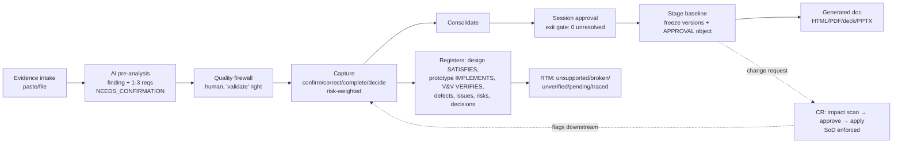

# DevStage01 — Current-State Audit

**Date:** 2026-07-04
**Auditor:** Claude (7 parallel subsystem readers + verification critic pass, ~1.1M tokens of source read)
**Baseline at audit time:** commit `88b8ec2`, 246/246 tests green (645 assertions), Pint clean.

---

## 1. Executive summary

DevStage01 (internally "URSB — Requirement-to-Prototype Platform") is **far more complete than "half-developed"**. The core value chain — evidence intake → AI pre-analysis → human quality firewall → capture → session approval → stage baseline → generated document/deck → design/prototype/verification registers → RTM — is **operable end-to-end, ACL-gated, versioned and tested** (246 passing tests, live demo seed exercising 13 object types across 2 tenants).

The genuine problems fall into four classes:

1. **Dead Track PMS inheritance presenting as live features** — the portfolio/project AI chat *always* returns 502 (container wiring never done), and ~16 files reference 9 classes that no longer exist. These fatal-if-executed remnants (sentiment, insights, monthly reports, Drive ingestion) mislead users and developers.
2. **Enforcement gaps where UI and server diverge** — the stage-gate page says "not ready" but the POST endpoint baselines anyway; an approved session can be silently replayed via `preAnalyze()`.
3. **Missing spec pillars** — no Project Objective Baseline (nothing anchors the chain above BRS), no comments/discussions at any level, no AI refinement actions beyond one-shot pre-analysis, no Objective Guardian, no reopen workflow, no guided setup, no Next Best Action.
4. **No documentation** — no `docs/` directory existed before this audit; the three root markdown files are stale or stock.

---

## 2. Existing architecture (§4.1)

| Aspect | Current state |
|---|---|
| **Stack** | Laravel 13.8 / PHP 8.3 / MySQL (dev) + sqlite `:memory:` (tests). Tailwind v3 + Vite + Alpine (build committed — no npm needed at runtime). Vendor directory committed. |
| **Key packages** | `anthropic-ai/sdk` 0.30, `barryvdh/laravel-dompdf` (PDF), `phpoffice/phppresentation` (PPTX), `phpoffice/phpword` (DOCX read), `smalot/pdfparser`, `google/apiclient` (dead — see §5), larastan, pint |
| **App structure** | Service-layer architecture: `app/Services/{Graph, Session, Change, Verification, Design, Prototype, Issue, Metrics, Portfolio, AccessControl, Knowledge, Rag, Document}` behind thin PDP-gated controllers |
| **Database** | 63 migrations. Canonical spine: `objects` (generic engineering object + JSON `attributes`) / `object_versions` (immutable snapshots) / `trace_relationships` (typed edges) / `object_id_sequences`. Portfolio: `tenants → projects → modules → stages → requirement_sessions → stage_baselines/baseline_objects`. ACL: `acl_roles/permissions/role_permission/scope_bindings/object_rules/field_rules/delegations/access_audit`. AI: `rag_chunks/rag_documents/chat_sessions/chat_messages`. `change_requests` sits outside the graph (own table). |
| **Authentication** | Session-based, login throttled twice (route `throttle:10,1` + per-email+IP lockout 5/60s), session regenerated on login/invalidated on logout, DB session driver, http_only + same_site lax cookies |
| **User/role model** | `users.system_role` (admin/director/regular/client, legacy `role` fallback via `effectiveSystemRole()`) + 6 seeded ACL roles (admin, director, project_pm, project_pe, project_member, client) × 8 actions (view, edit, retrieve, validate, approve, baseline, assign, export) |
| **ACL engine** | Central `PolicyDecisionPoint` (deny-by-default, layered: admin fast-path → director read → covering scope binding tenant>project>module>stage>session → role-permission with explicit-deny-wins → object rules by classification/status → field-level redaction). Time-bound bindings, delegation with expiry sweep (`acl:expire` hourly), immutable access audit with IP/request-id. Request-scoped caches with write-busting. |
| **LLM integration** | `AnthropicClient` (Messages API, temp 0, retry, status-only errors), `VoyageClient` (embeddings). Working: LLM evidence pre-analysis (`LlmEvidenceAnalyst`, strict JSON, deterministic fallback), evidence RAG indexing (paste/PDF/DOCX). Broken: both chat endpoints (see F-01). Keys encrypted at rest in `system_settings`, admin UI write-only. |
| **Document generation** | Baseline documents render from **frozen `object_versions` snapshots** (not live objects): HTML + branded PDF + slide deck (HTML + native PPTX). Content is generic type-grouped sections (`DeckBuilder::SECTION_ORDER`) — **no BRS/URS/SRS/SDS-specific templates**. |
| **File storage** | Evidence on default `local` (private) disk at `evidence/{project_id}`, finfo MIME allow-list, 10MB cap. **No download/view endpoint exists** for evidence files (write-only). Feedback attachments have a hardened download path (nosniff, octet-stream clamp). |
| **APIs** | None external. All server-rendered Blade + a few JSON XHR endpoints (chat, notifications, releases.seen). |
| **Deployment** | Hostinger multi-env via GitHub webhook (`deploy.sh`: npm-optional, compiled assets committed, config/route/view cache). No CI pipeline. Only scheduled job: `acl:expire`. **No queue worker assumed — and none needed by live code** (all `dispatch()` call sites are dead code referencing missing job classes). |

---

## 3. Existing functional workflow (§4.2)

### What actually works end-to-end (verified by readers + passing tests + demo seed)

### Where the flow stops, is unclear, or diverges

| Point | Problem |
|---|---|
| **Entry: project creation** | `PortfolioController::storeProject` creates the bare Project row only — **no scope bindings** (new project invisible to every non-admin/director until manual ACL grant), **no objective capture**, no wizard, no first module/stage nudge. The chain's anchor (project objective) has no structured existence anywhere: no OBJECTIVE object type, no sponsor/problem/scope/success-measure fields (grep-verified). |
| **Stage gate** | Gate page computes 3 hard conditions (approved session, 0 unresolved, not baselined) but **POST `/stages/{stage}/baseline` re-checks only "has approved session"** — server enforcement diverges from UI (F-05). KB gate criteria are display-only advisory. No stage-order gating (SRS can baseline before BRS). No orphan-requirement/risk-recorded/AC checks at the gate. |
| **Session lifecycle** | `preAnalyze()` and `capture()` have **no phase guard** — POSTing pre-analyze to an *approved* session resets it to `firewall_review` and the whole chain replays (uncontrolled reopen, F-06). The `rejected` enum value exists but no code path ever sets it — there is **no refine/reject loop**. |
| **Reopen** | No first-class reopen anywhere (baseline, session, stage). Only substitutes: re-baseline (supersedes) and CR-based per-object edits. |
| **Refinement after approval** | No comments/discussions at any level (project/stage/document/section/object). No AI refinement actions (improve/challenge/generate-AC/check-against-objective). Once captured, content is only editable via raw `edit` or CR. |
| **Documents** | Generated docs are type-grouped object dumps — not the §15 BRS/URS/SRS/SDS section structures. No configurable templates. |
| **Client experience** | `client` role exists and scoping works, but a bound client sees the **same staff screens** (metrics, risks, registers) subject only to field redaction. No internal-vs-client-visible content separation exists anywhere (grep-verified: no visibility/is_internal flag). |
| **Guidance** | Static `/guide` page only. No setup wizard, no per-stage/section contextual guidance, no Next Best Action, no quality-indicator explanations. |

---

## 4. Gap analysis vs the DevStage01 master specification (§4.3)

Severity classes: **CRITICAL** (broken/dangerous now) / **HIGH** (spec pillar absent or enforcement gap) / **MEDIUM** / **LOW** / **ENH**.

### 4.1 CRITICAL findings

| ID | Finding | Current behaviour | Expected | Impact | Files |
|---|---|---|---|---|---|
| **F-01** | Portfolio + project AI chat can **never** answer | `ToolRegistry::__construct(array $tools)` never bound in any provider → `app(RagService::class)` throws `BindingResolutionException`; `PortfolioChatController::ask()` catches Throwable → always 502 "AI service is unavailable" even with valid keys. Confirmed live via tinker. | Chat answers using project-scoped RAG | Flagship AI feature silently dead; users blame keys | `app/Providers/AppServiceProvider.php:29`, `app/Services/Rag/ToolRegistry.php:8`, `PortfolioChatController.php:50-56` |
| **F-02** | 9 nonexistent classes referenced by 16 live files | `SourceTextBuilder`, `RagIndexer`, 4/5 chat tools, `SentimentScorer`, `ProjectInsightService`, `MonthlyReportService` reference `App\Models\{Issue, ClaimMilestone, WeeklyUpdate, ProjectComment, ProjectWeekNote, WbsItem, LedgerEntry}`, `App\Services\{ProjectCalculator, MoneySummaryService}` — **fatal if executed** | Dead code removed or rewired to URSB entities | Latent fatals; misleads maintenance; phpstan can't pass | `app/Services/Rag/SourceTextBuilder.php`, `app/Services/Sentiment/*`, `app/Services/{MonthlyReportService,ProjectInsightService}.php`, `app/Console/Commands/SentimentBackfill.php` |
| **F-03** | Per-project chat routes miswired | GET `/chat` binds no `{project}` for `ChatController::index(Project $project)`; POST `/chat/message` targets nonexistent `ChatController::send`; view references unregistered route names; `syncDrive` dispatches missing `App\Jobs\SyncDriveDocsJob` | Working or removed | 500s on click | `routes/web.php:163-166`, `app/Http/Controllers/Project/ChatController.php` |
| **F-04** | Static analysis false-green | `phpstan analyse` exits 1 with zero output on this machine (ZTS PHP crash — even `parallel: 1` doesn't fix it); `scripts/phpstan.sh` loops per-file, discards stderr, and **treats silent crash as pass**. "Level 5 clean" claim unverifiable and likely false (F-02's missing classes would fail level 0). | Working analysis or honest failure | Quality gate is fiction | `phpstan.neon`, `scripts/phpstan.sh` |

### 4.2 HIGH findings

| ID | Finding | Detail | Files |
|---|---|---|---|
| **F-05** | Baseline POST bypasses gate | Server checks only "has approved session"; unresolved-items and already-baselined checks live only in the read-only gate view. Direct POST freezes `needs_confirmation`/`conflict_detected` objects into an "APPROVED BASELINE". | `StageController.php:112-126` |
| **F-06** | Session phase not guarded on entry points | `preAnalyze()` unconditionally sets `phase='firewall_review'` (replayable approved sessions); `capture()` validates only the decision keyword, no phase check. | `SessionEngineService.php:46-80,182` |
| **F-07** | **No Project Objective Baseline (spec §6)** | No OBJECTIVE type, no structured objective fields (sponsor/problem/scope/out-of-scope/success measures/constraints), nothing to evaluate requirements or CRs against. The spec's anchor concept is absent. | (absent) |
| **F-08** | **No comments/discussions (spec §12)** | No comment table/model/UI at any level. Orphan Track policies remain (`ProjectCommentPolicy` imports a nonexistent model — latent fatal). No internal/client-visible separation. No convert-comment-to-requirement/risk/decision/CR. | (absent), `app/Policies/ProjectCommentPolicy.php:6` |
| **F-09** | **No AI refinement engine (spec §10)** | Only generative AI over requirements is one-shot evidence pre-analysis. No improve-wording / challenge / generate-AC / find-contradictions / check-against-objective / impact-analysis actions; no accept-edit/save-as-alternative suggestion flow. | (absent) |
| **F-10** | **No Objective Guardian (spec §7)** | No alignment classification of changes/additions against objectives anywhere. | (absent) |
| **F-11** | No reopen workflow (spec §9) | Stage lifecycle missing `Refinement Required` + `Reopened`; session `rejected` enum never set; baselines only supersede-by-replacement. | `SessionEngineService`, `BaselineService` |
| **F-12** | New projects born invisible & objective-less | `storeProject` creates row only; no creator scope binding, no team, no objective, no guidance. | `PortfolioController.php:122-137` |
| **F-13** | Google Drive ingestion pipeline is dead code | Missing job class, no registered sync routes, no admin UI for the required service-account setting. | `DriveIngestService`, `ChatController::syncDrive` |
| **F-14** | Chat stack has zero tests | No test touches `RagService`, `ToolRegistry`, or either chat controller — why F-01 shipped silently. | `tests/` |
| **F-15** | Stale root docs mislead | `EXTRACTION-COMPLETE.md` + `SETUP.md` claim broken modules (workload/reports/sentiment) are "Ready to Go"; `README.md` is stock Laravel. None of the 10 required §24 docs existed. | repo root |

### 4.3 MEDIUM findings

| ID | Finding | Detail |
|---|---|---|
| F-16 | Version snapshots incomplete | `ObjectGraphService::snapshot()` omits `classification`, `owner_user_id`, `source`, `source_object_id`, `baseline_id` — point-in-time state unrecoverable for those fields. No version-content view, no compare/diff, no restore (spec §22). |
| F-17 | RTM gap classes partial (spec §8) | "No design coverage" doesn't affect row status (zero-design requirement still reads *traced*); no acceptance-criteria gap class (no code path even creates an AC object); duplicates/contradictions not in matrix; orphan detection only in separate Coverage page. |
| F-18 | CRs are not graph objects | Own table → not traceable/versionable/baselineable; `ObjectType::CHANGE_REQUEST` exists unused. Impact analysis stores refs at *open* time only; downstream marking is a single `NEEDS_CONFIRMATION` status, not the spec §13 classes (no-impact/review-required/update-required/invalidated/superseded); no before/after comparison view. |
| F-19 | Role model vs spec §17 | 6 roles only; spec roles (Org Admin, Project Owner, System Analyst, Architect, UX, Developer, QA/Business/Client Reviewer, Approver, Read-only) unrepresented; schema supports tenant-scoped roles but **no role-management UI** (seed-only). |
| F-20 | Tenant isolation is procedural, not structural | No Eloquent global scopes; route model bindings unscoped; every controller must remember the PDP check (today all URSB routes do). `projects.tenant_id` nullable at DB level. |
| F-21 | Object browser memory-unbounded | Row-by-row PDP filter then manual pagination — loads all project objects per page render. |
| F-22 | `ObjectGraphService::update()` accepts any fillable incl. `ref`/`type` | Identity mutation possible through the service. |
| F-23 | Conflict detection is duplicates-only | Exact normalized-title equality within a single session; no cross-session/cross-stage/semantic contradiction detection (spec §2/§10). Scan is manual-only (not auto pre-approval). |
| F-24 | Consolidate is a status flip | No dedup/merge/summary/completeness recompute. |
| F-25 | `InitialDataSeeder` stale & unsafe | Not called, non-idempotent, writes API keys **plaintext** via `DB::table` bypassing encryption. |
| F-26 | No CI | No `.github/workflows`; tests/pint run by hand only. |
| F-27 | LLM ops gaps (spec §11) | Prompts are hardcoded strings (no versioning/templates); no usage/token/cost logging; no AI activity audit trail; single-provider hardwired; JSON validation single-shot (no retry/repair). Isolation itself is good (PDP-scoped retrieval, tested). |

### 4.4 LOW / ENHANCEMENT

- Dead enum values: `stages.in_review`, `stage_baselines.draft`, session `rejected` (declared, never set).
- `RelationType::inverse()` and ~4 relation types (REFINES, DEPENDS_ON, SUPERSEDES, MITIGATES) defined but never created; no manual trace-link authoring UI.
- `objects.approval_id` column never populated (approval linkage lives as APPROVES edges instead — fine, column is vestigial).
- Object detail page lacks dedicated "related screens/tests/approvals" sections (visible only as generic trace rows).
- Evidence files not downloadable after upload (write-only storage).
- No object/session/module/project delete UI (soft-delete semantics unexercised); no retention story.
- Baseline concurrency: transactional but no explicit serialization against double-POST.
- Only `UserFactory` exists; graph/portfolio models built by hand in tests.
- ID format deviates from spec examples (`BRS-REQ-0001` vs `BRS-BR-001`) — **keep current format**; it is established, consistent, and per-(project,type) unique.
- Pagination default Tailwind view unstyled in places; minor.

---

## 5. Code quality assessment (§4.4)

**Dead code (remove):** `SourceTextBuilder`, `RagIndexer` (old), `SentimentScorer` + `sentiment_scores` usage + `SentimentBackfill`, `ProjectInsightService::generate` (no caller), `MonthlyReportService` (fatal imports, unregistered route), 4 dead chat tools, `DriveIngestService` chain, orphan `ProjectCommentPolicy`/`IssueCommentPolicy`, `InitialDataSeeder`, broken `Project/ChatController` routes, `scripts/phpstan.sh` (false-green), Workload/Calendar Track leftovers (decision needed — currently routed but un-audited/untested).

**Duplicate logic:** stage-gate readiness computed in `gate()` and *partially* re-computed in `baseline()` — unify into one service method (fixes F-05 as a side effect).

**Over-engineering:** none material. **Under-engineering:** change-impact model (single status flag), consolidate(), conflict detection.

**Security posture:** strong overall — deny-by-default PDP with immutable audit, SoD, field redaction, encrypted secrets, CSV formula-injection guards, LIKE-escape, throttles, MIME allow-list, project-scoped trace walks (cross-tenant leak fixed in `ee46153`). Weaknesses: F-05/F-06 (integrity, not confidentiality), F-20 (structural net absent), F-25 (plaintext seeder).

**Test suite:** 246 methods / 49 feature files, ~14s, meaningful coverage of every core URSB area incl. tenant isolation, ACL, versioning, baselines, CR+SoD, AI fallback, exports, smoke-test over every page. Gaps: chat stack (F-14), reopen (doesn't exist), comments (don't exist), all inherited Track modules.

---

## 6. What must be preserved (explicitly)

1. The **hybrid object graph** (generic `objects` + JSON attributes + immutable `object_versions` + typed edges + per-(project,type) ID sequences) — it already delivers spec §8 traceability better than a normalized-per-type schema would.
2. The **PDP/ACL engine** with its audit trail, delegation, redaction — spec §17/§18 foundation is done; extend, don't replace.
3. The **session engine's human-in-the-loop discipline** (firewall, risk-weighted capture, exit gate) — this *is* spec §10's "AI advises, human decides" pattern for the intake path.
4. **Baseline-from-frozen-snapshots** document rendering.
5. The **register pattern** (service + gated controller + Tailwind view + tests + demo seed) — every new feature should follow it.
6. The test suite + demo seeders (two-tenant lifecycle proof).

---

## 7. Unresolved questions (tracked as assumptions in ASSUMPTIONS-AND-DECISIONS)

- Whether Workload/Calendar/Feedback/Releases Track modules are wanted product surface or candidates for removal (kept + untouched this pass; releases/feedback/guide are live and useful).
- Queue/mail runtime on Hostinger (no live code needs a queue after dead-code removal; notifications remain in-app only).
- Baseline double-POST race (transactional; explicit lock deferred).
