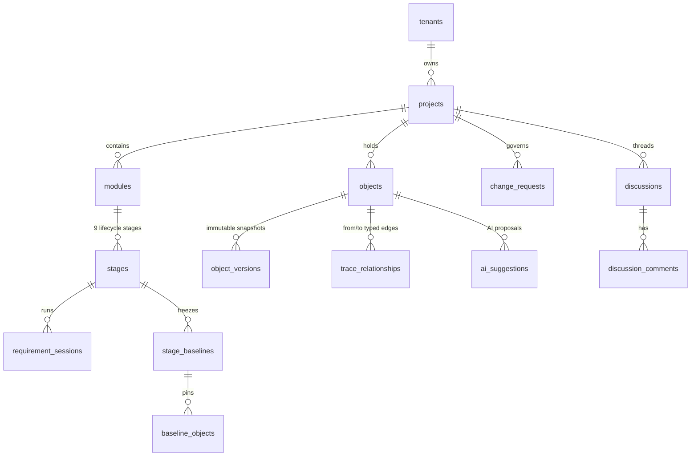

# DevStage01 — Data Model

**Date:** 2026-07-05. Authoritative schema record; migrations in `database/migrations/` are the source of truth.

## 1. Canonical object graph (the spine)

| Table | Purpose | Key facts |
|---|---|---|
| `objects` | Every engineering artefact (27 types: OBJECTIVE, EVIDENCE, FINDING, BRS/URS/SRS requirements, BUSINESS_RULE, ASSUMPTION, CONFLICT, DECISION, RISK, ACCEPTANCE_CRITERION, design types, PROTOTYPE_ELEMENT, TEST_CASE/RESULT, DEFECT, ISSUE, APPROVAL…) | Hybrid storage: common columns + JSON `attributes`. Permanent ref `{PREFIX}-{NNNN}` unique per (project, type) via `object_id_sequences` (locked). `type`/`status` enums derived from PHP enums at migrate time. Soft-delete only. `classification` drives field redaction. `baseline_id` set = frozen (edits only via CR or reopen). |
| `object_versions` | Immutable history | One JSON snapshot per version; model throws on update/delete; unique (object_id, version). |
| `trace_relationships` | Typed directed edges | 12 relation types; unique (from, to, relation); all walks project-scoped. Live: DERIVED_FROM (evidence→finding→req, objective→req, discussion conversions), SATISFIES (design→req), IMPLEMENTS (proto→req), VERIFIES (TC→req), TRACES_TO (result/defect→TC), CONFLICTS_WITH, RESOLVES (decision), APPROVES (approval), REFINES (AC→req). |
| `stage_baselines` | Frozen stage rollups | status draft/approved/superseded/**reopened**; `snapshot_meta` records counts, session ids, **gate exceptions** (checks/reason/by/at); reopen columns (`reopened_by/at`, `reopen_reason`). |
| `baseline_objects` | Membership pins | (baseline, object, object_version, ref, type) — historical truth even after reopen. |
| `requirement_sessions` | Session engine state | `phase`: pre_analysis→firewall_review→ready→in_session→post_session→approved; firewall approve + **reject** columns (`firewall_rejected_by/at/reason`). |
| `change_requests` | Controlled change | CR-NNNN ref, `proposed_changes` + `impact` JSON, **`guardian_assessment`** JSON + **`override_reason`**, status draft/approved/applied/rejected. Downstream flags live on objects: `attributes.impact` (review_required/no_impact/update_required/invalidated) + `attributes.impact_from` (CR ref). |
| `discussions` / `discussion_comments` | Spec §12 threads | Polymorphic on Project/Stage/Session/StageBaseline/EngObject; `visibility` internal\|client (query-enforced); `blocking` holds stage gate; assignee/due; comments carry `converted_ref` after convert-to-X. |
| `ai_suggestions` | Spec §10 proposals | action, status proposed/accepted/accepted_edited/rejected, JSON `payload`, model, `prompt_version`, decider + note. |
| `ai_usage_log` | Spec §11 cost | feature, model, tokens_in/out per call. |

## 2. Objective Baseline

The project objective is an `objects` row (`type=objective`, OBJ-NNNN) at project level (module/stage/session NULL): structured fields in `attributes` (sponsor, scope, out_of_scope, success_measures, constraints…), `body` = business problem. Revision = new version + status back to NEEDS_CONFIRMATION (re-approval required). Approval mints an APPROVAL object + APPROVES edge. BRS gate hard-checks it (overridable with recorded exception).

## 3. ACL & tenancy

`acl_roles` (global or tenant-scoped) × `acl_permissions` (8 actions) via `acl_role_permission`; `acl_scope_bindings` bind user+role to tenant/project/module/stage/session (time-bound, revocable); `acl_object_rules` (classification/status attribute denies) + `acl_field_rules` (redaction); `acl_delegations` own auto-expiring bindings; `acl_access_audit` immutable. All isolation enforced by `PolicyDecisionPoint` at controllers — no Eloquent global scopes (structural backstop deferred; see assumptions doc).

## 4. RAG / knowledge

`rag_chunks` (tenant_id + scope project|global, embeddings), `rag_documents`, `chat_sessions`/`chat_messages`, `knowledge_books`/`knowledge_book_items` (KRISA, question banks, stage gates), `project_knowledge_items`/`_pins`, `system_settings` (encrypted API keys).

## 5. Track PMS remnants kept

`projects`, `users` (system_role + legacy role), `notifications`, `audit_logs`, `feedback_items/attachments`, `releases`, `calendar_events`, `departments/positions/salary_bands` (workload module), `monthly_reports`/`report_deliveries`/`sentiment_scores` (tables retained, code removed — safe to drop in a later migration once confirmed unused in production data).
