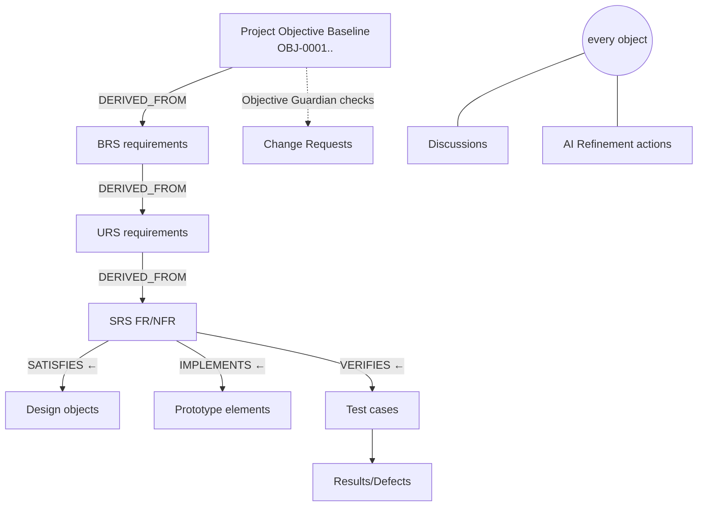

# DevStage01 — Product Blueprint

**Date:** 2026-07-04
**Basis:** [DEVSTAGE01-CURRENT-STATE-AUDIT.md](DEVSTAGE01-CURRENT-STATE-AUDIT.md). This blueprint defines the improved platform **on top of the existing codebase** — every element below names the existing mechanism it extends. Nothing here requires replacing the object graph, PDP/ACL, session engine, baseline machinery or register pattern.

---

## 1. Product definition

DevStage01 guides a project from business idea → Objective → BRS → URS → SRS → SDS → Prototype → Validation, producing a **connected chain of evidence** where every design decision traces to a requirement, and every requirement to an objective. It is a *continuous refinement* platform, not a document generator: humans and AI challenge, discuss, and change content at every level, and the system shows the impact.

## 2. The seven pillars (delta from current state)

### P1 — Project Objective Baseline (new; spec §6)
- New `ObjectType::OBJECTIVE` (`OBJ-NNNN`) — a first-class graph object at **project level** (module/stage/session null), so it inherits versioning, tracing, ACL, redaction and approval for free.
- Structured `attributes`: sponsor, business_problem, current_situation, desired_outcome, target_users, scope, out_of_scope, success_measures, constraints (business/technical), regulatory, budget_assumption, timeline_assumption, known_risks, stakeholders — captured by a **guided wizard** at project creation (and editable after).
- Objective approval = existing APPROVAL machinery. **BRS stage gate gains a hard check: approved objective exists.**
- BRS requirements auto-link `DERIVED_FROM → OBJ` when created in sessions (the existing evidence→finding→requirement chain gets an objective root).

### P2 — Enforced stage gates + honest lifecycle (fix + extend; spec §9)
- One `StageGateService::readiness(Stage)` used by BOTH the gate page and the POST baseline endpoint (kills the UI/server divergence).
- Gate checks (hard): approved session • zero unresolved objects • not already baselined (unless explicit re-baseline intent) • approved objective (BRS) • **previous stage baselined** (ordered gating via `LifecycleStage::ordered()`) • zero open discussions marked blocking.
- **Approve-with-exception:** authorised users may baseline with failing soft checks; exception + reason recorded on the baseline (`snapshot_meta.exceptions`) and surfaced on the document.
- **Reopen:** `BaselineService::reopen(baseline, reason)` → baseline status `reopened`, stage back to `in_progress`, member objects unlocked (baseline_id cleared, status `needs_confirmation`), REOPENED audit + notification. Session phase guards added (`preAnalyze`/`capture` assert phase).

### P3 — Discussions everywhere (new; spec §12)
- One polymorphic `discussions` table (+ `discussion_comments`): attachable to Project / Stage / Session / StageBaseline / EngObject.
- Fields: title, status (open/resolved), **visibility (internal | client)**, blocking flag, assignee, due date.
- Comments support reply + resolve/reopen + **convert-to**: requirement / risk / decision / change-request / issue — each conversion mints the corresponding graph object with a `DERIVED_FROM` trace back to a DISCUSSION reference and closes the loop.
- Client users (`client` ACL role) see only `visibility='client'` discussions — enforced in the query layer, not the view.
- Gate integration: open blocking discussions block baseline (hard check in P2).

### P4 — AI Refinement Engine (new; spec §10)
- `RefinementService` + `ai_suggestions` table: `{object_id, action, status(proposed/accepted/accepted_edited/rejected/alternative), proposed_title, proposed_body, rationale, confidence, sources, model, prompt_version, created_by, decided_by}`.
- Actions v1 (per requirement-family/design object): **Improve wording • Challenge this • Generate acceptance criteria • Find missing information • Check against objective**.
- Each action = one prompt template (versioned in `config/prompts.php`), strict-JSON response, single retry with repair hint, deterministic refusal on failure (never fake content).
- **Never overwrites**: accepting applies via `ObjectGraphService::update` (new immutable version, change summary "AI suggestion SUG-n accepted by X"); accept-and-edit opens prefilled edit; reject records reason. Generate-AC creates `ACCEPTANCE_CRITERION` objects linked `REFINES → requirement` (activates the dead AC type + REFINES relation).
- Every suggestion logs tokens in/out → `ai_usage_log` (spec §11 cost monitoring).

### P5 — Objective Guardian (new; spec §7)
- `ObjectiveGuardianService::assess(target, proposedChange)` → classification ∈ {aligned, potential_improvement, scope_expansion, possible_conflict, direct_conflict, insufficient_information} + reasoning + affected objective refs + questions.
- Wired into: **CR creation** (assessment stored on the CR, shown to approver) and the **Check against objective** refinement action. LLM-backed with deterministic fallback (`insufficient_information` + "no approved objective found" when objective missing).
- Advisory only: approvers may override; override reason required and stored.

### P6 — Change impact classes + comparison (extend; spec §13)
- `ChangeManagementService::apply()` upgraded: downstream objects get explicit `impact` marking in attributes (`review_required` default; UI to set `no_impact`/`update_required`/`invalidated` per item as they're worked off) instead of the single NEEDS_CONFIRMATION status alone.
- CR show page gains **before/after comparison** (current vs proposed title/body diff) and the Guardian verdict.
- CRs keep their own table (pragmatic; audit F-18 noted) but gain `guardian_assessment` + `override_reason` columns.

### P7 — Guided experience (new; spec §14)
- **Setup wizard**: create project → capture objective (staged form) → first module → team grants (fixes F-12: creator gets a binding, invisible-project trap removed).
- **Next Best Action** panel on project page: derived rules over existing services (no objective → "Capture objective"; unresolved items → "Resolve N items in session S"; gate ready → "Baseline BRS"; open blocking discussion → "Resolve discussion D"; failing verification → "Fix defect DEF-n"...).
- **Contextual guidance**: per-stage explainer cards (what/why/who/good example/common mistakes) driven from the Knowledge Book (`item_type='guidance'`), shown on stage gate + session pages.
- Quality indicators: reuse Metrics/Coverage/RTM percentages, each with a "how computed" tooltip.

## 3. What deliberately stays as-is
- ID format `{PREFIX}-{NNNN}` (established, unique, tested).
- Hybrid graph storage; CRs outside the graph; document rendering from frozen snapshots.
- Session engine five-phase flow and capture taxonomy.
- Tailwind component-class design system (`card`, `btn-*`, `badge-*`, `data-table`, `stat-card`).
- In-app-only notifications (no mail dependency).

## 4. What gets removed (dead Track PMS inheritance)
`SourceTextBuilder`, old `RagIndexer`, `SentimentScorer`+backfill command, `MonthlyReportService`, `ProjectInsightService`, dead chat tools, `DriveIngestService` chain, orphan comment policies, `InitialDataSeeder`, broken project-chat routes, false-green `scripts/phpstan.sh`. Chat is **rebuilt minimal**: `ToolRegistry` bound with URSB-native tools (`ProjectSummaryTool` fixed + graph search tool) so `/portfolio/chat` genuinely answers.

## 5. Security & tenancy posture (spec §17/18/23)
- Keep PDP as the single authority. Add `BelongsToTenant` global scope on `Project` as a structural backstop (defence in depth under the PDP, not a replacement).
- Client visibility separation implemented at query layer (P3).
- New writes all PDP-gated (`edit`/`validate`/`approve`) + type-asserted, following the register pattern.
- AI endpoints throttled; suggestion bodies capped; prompt templates never interpolate other tenants' content (retrieval stays PDP-scoped).

## 6. Non-goals (this phase)
- Configurable per-client document template designer (templates stay code-defined; §15 structure honoured in the baseline document renderer by type→section mapping).
- External APIs, SSO, queue infrastructure, semantic (embedding-based) contradiction detection, Trello integration.
- Role-management UI beyond seeded roles (schema supports it; deferred).
